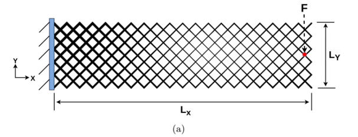
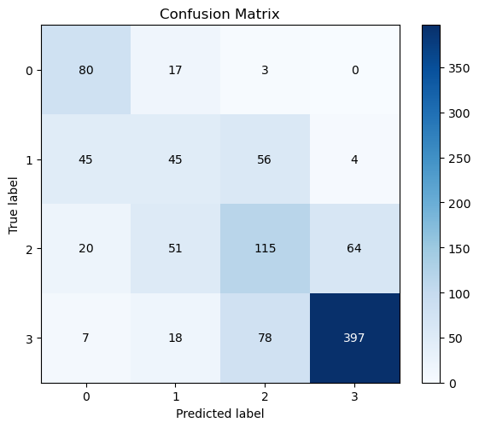
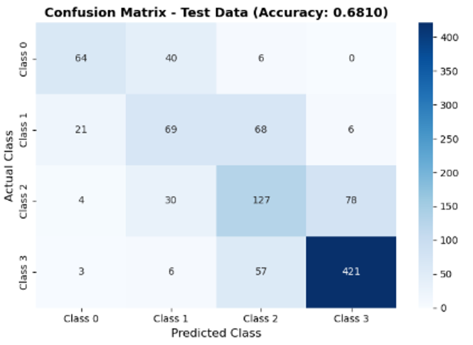
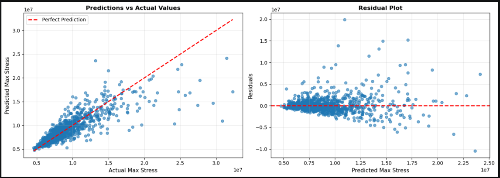

# Structural Stress Prediction Project

This project implements machine learning solutions for a structural mechanics problem based on the provided simulation data. The workflow includes:

- A classification model to predict stress severity classes from engineered feature vectors.
- A regression model to predict maximum stress values.
- Several notebook-based experiments comparing different modeling approaches.

## Project Goal


*Figure: Geometry and boundary conditions of the lattice beam model used for feature extraction and stress analysis.*

The goal is to learn mappings from structural input features to:

1. Stress class labels (categorical classification)
2. Maximum stress values (continuous regression)

The project uses processed input files and trained model artifacts stored in the repository.

## Repository Contents

- Classification.ipynb
  - Deep learning classifier for 4 stress classes.
  - Uses input_features.csv and stress_classifications.csv.

- Max_stress_NN.ipynb
  - Neural network regression model for predicting max stress.
  - Uses input_features.csv and max_stress_list.txt.

- Regression_mv.ipynb
  - Alternative regression experiment for max stress prediction.

- input_features.csv
  - Feature matrix used for training and evaluation.

- max_stress_list.txt
  - Target values for the regression task.

- stress_classifications.csv
  - Class labels for the classification task.

- models/
  - Saved trained models and preprocessing artifacts:
    - classification_model.keras
    - classification_model_improved.keras
    - classification_scaler.joblib
    - max_stress_model.keras
    - scaler.joblib
    - y_scaler.joblib

- data_info.txt
  - Information about the original dataset source and file structure.

## Model Results

### Classification Results

These confusion matrices summarize classification model performance on the stress class prediction task:



*Figure: Confusion matrix for the direct classification model, showing predicted vs actual stress severity classes.*



*Figure: Confusion matrix for the indirect classification model, showing how predicted classes compare to actual labels.*

### Regression Results

The regression results plot shows training progress and evaluation metrics for max stress prediction:



*Figure: Regression training and validation performance for the max stress neural network model.*

## Dataset Notes

The large original simulation dataset used to generate the processed files is not included in this repository because of its size. The file data_info.txt contains details about the source dataset and how it is organized.

If you want to reproduce the workflow from the raw source data, download the dataset described in data_info.txt and place it in a suitable local folder before running the notebooks.

## Environment Setup

Use a Python environment with the following packages installed:

- pandas
- numpy
- matplotlib
- seaborn
- scikit-learn
- tensorflow
- joblib

A typical installation command is:

```bash
pip install pandas numpy matplotlib seaborn scikit-learn tensorflow joblib
```

## How to Run

1. Open the project folder in Jupyter Notebook or VS Code.
2. Run the cells in Classification.ipynb to train and evaluate the classification model.
3. Run the cells in Max_stress_NN.ipynb or Regression_mv.ipynb for regression experiments.
4. The notebooks assume the required CSV/text files are located in the project root directory.

## Model Summary

- Classification task:
  - Neural network with a softmax output layer.
  - Designed for 4 classes.
  - Evaluated using accuracy and classification reports.

- Regression task:
  - Neural network trained to predict continuous max stress values.
  - Uses standardization for both input features and target values.
  - Includes training, validation, and evaluation steps.

## Expected Output

Running the notebooks will generate:

- Training and validation performance plots
- Classification reports and confusion matrices
- Saved model files in the models/ directory